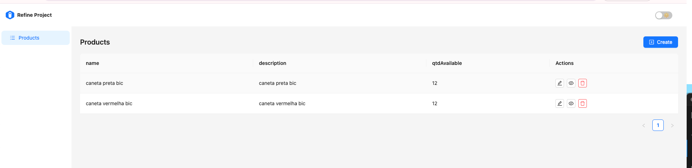

# Cloud Project
This project was the evaluation of the Cloud Computing discipline, PPGTI2001, from the UFRN master's degree. It needs to create a pod with multiple containers, it must be raised and it must meet the following requirements:
- The pod must have 4 containers and must be created using a
Kubernetes manifest (yaml file);


Students:
- Ramon Domingos Duarte Oliveira [20231026233]
- Gerfesson Santos da Nobrega [20231026206]

## About applications

### API

Product registration API

```JSON 
{
"name": "PEN_BLACK",
"description": "black pen, with transparent body",
"qtdAvailable": 12
}
```
- /product  `(get, post)`
- /product/:id  `(put, delete, get)`

### FRONT
Application that consumes the API, displaying listings and forms.
Using https://refine.dev/ as a base template.

### Docker-compose
For run using only docker-compose use 
```bash 
docker-compose up
```

services:
- mongo: MongoDB for product registration
- redis: Cache for frequent requests
- api : REST api to connect to the database.
- front: Front using React.

## Kubernets 

### Step 1: Send this  images for personal DockerHub (optional)
 To build api image
```bash 
cd api
docker build -t <your_username>/api-products .
docker push  <your_username>/api-products
```
To build front image
 ```bash 
cd frontend
docker build -t <your_username>/front-products .
docker push  <your_username>/front-products
```
If you create custom images, go to the `k8s/*-deployment` files and change the image to yours.

<!-- my script
 ```bash 
cd api
docker build -t ramondomiingos/api-products .
docker push  ramondomiingos/api-products
cd ..
cd frontend
docker build -t ramondomiingos/front-products .
docker push  ramondomiingos/front-products
cd ..
```
-->

The images MONGO and REDIS is oficial images, are already available on dockerhub for use.


 > It is expected that the machine environment is already pre-configured, and masters a workers joined, using `kubeadm join --token` command

### Step 2: Create namespace

```bash
kubectl get ns
kubectl create namespace products-application
kubectl get ns
kubectl config get-contexts
kubectl config set-context --current --namespace=products-application
```

**[output]** 

kubectl config set-context --current --namespace=products-application


```bash
kubectl config get-contexts
```

**[output]**
|CURRENT  | NAME                          |CLUSTER  |    AUTHINFO          | NAMESPACE|
|--------| ------------------------------| ----------| ----------| ---------- |
|\*        | kubernetes-admin@kubernetes  | kubernetes  | kubernetes-admin   |products-api|


### Step 3: create a Deployment
In the deployment files, has details about  the **image docker**  and a  **imagePullPolicy**. In this example is Always,
for Always deploy get a new image for dockerhub.
The line command is

```bash
 kubectl create deployment redis --image=redis --port=5701
```
but, in k8s directory has 4 yaml files to [api,front,mongo,redis]-deployment.yaml 

### Step 4: create a service
for expose the application for outside k8s, its necessary create a service
You can create with a command:
```bash
kubectl create service nodeport web-products --tcp=3000:3000 --node-port=30300
```

check the creation

```bash
kubectl get service
```

|NAME         |  TYPE       |CLUSTER-IP     | EXTERNAL-IP  |  PORT(S)      |    AGE |
| -----| -----|-----|----|----|---|
|web-products  | NodePort  |  10.97.135.212   <none>        |3000:30300 | TCP   |  3s | 


but, in k8s directory has 4 yaml files to [api,front,mongo,redis]-service.yaml 


### Step 5: Send files for MASTER node.


inthe folder `k8s`has 9 files
deployment and service for [api, front, mongo and Redis]

and 1 file for **ingress**;

send this file for your master ( can use scp)
```bash
scp k8s/*  remote_username@10.10.0.2:/remote/directory
```
<!--
scp k8s/* ramon@1192.168.64.2:/
-->

### Step 6: Apply spec file

In sequence need apply this file, and check pods.


```bash
kubectl apply -f . 
```
** [output]**

For apply all files use  `kubectl apply -f .`
**[output]**
```bash
\# kubectl apply -f .
deployment.apps/api created
service/api created
deployment.apps/front created
service/front created
deployment.apps/mongo created
service/mongo created
deployment.apps/redis-service created
service/redis-service created
```

```bash
kubectl get pods
```
**[output]**
|NAME           |READY  | STATUS |             RESTARTS  | AGE|
| ---|            ----    | ---- |  ---------| --|
|web-products   |0/4     |ContainerCreating |  0       |   40s |

while containers are created, check the logs with:
```bash
kubectl logs web-products
```
If it takes a long time to successfully create the containers, check the logs individually to see if any errors occurred, if necessary correct and apply this file again.
```bash
kubectl logs web-products -c [redis-service, mongo, frontend, api]
```
 > erro example: 
> |NAME       |    READY  |  STATUS      |       RESTARTS      |  AGE| 
> | ----- | ------- | ------- | ------ | ------| 
> |web-products  |   3/4     | CrashLoopBackOff  |   12 (24s ago) |   10m | 

after a few seconds, you can run this same command, and will see:

|NAME       |    READY  |  STATUS      |       RESTARTS      |  AGE| 
 | ----- | ------- | ------- | ------ | ------| 
| web-products |   4/4  |    Running |  0 |          22s | 

### Step 7: Check your application.

Go to browser, visit `http://<ip-worker>:3000` and see the applcation.

3000 is the port that expose in yaml files.

### Step x: Create Volumes


# Personal learning

- In our scenario, we need to expose the api, since the requests made by the front were client-side, using an internal IP would not work.
- All pods have many environment variables in the format <NAME>_SERIVCE_HOST to identify other services, and can be used in yaml as configuration envs. [Example](k8s/api-deployment.yaml) line 39.
- To see all envs you can use `kubectl exec <pod-name> printenv`.